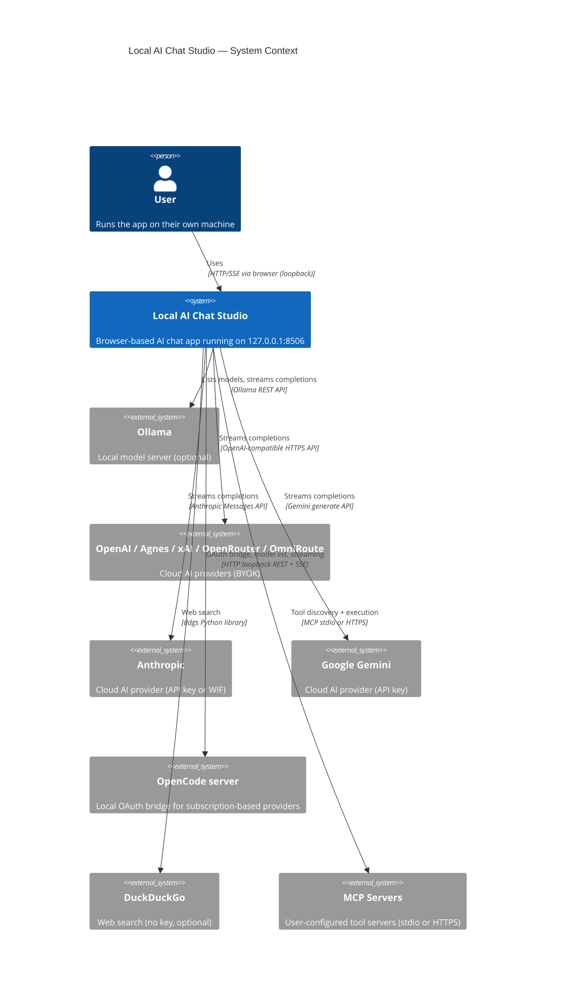
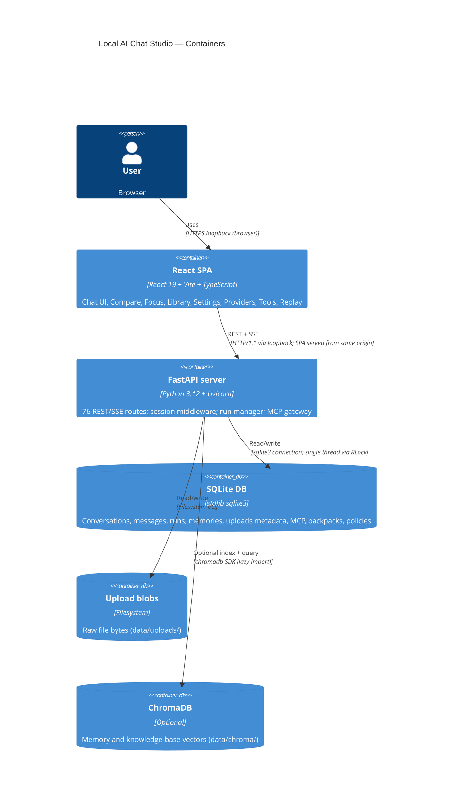
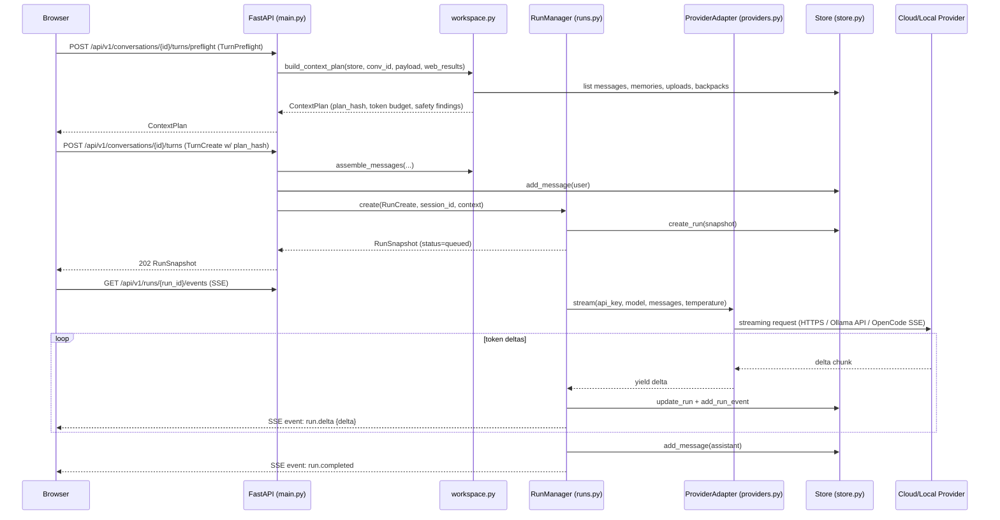
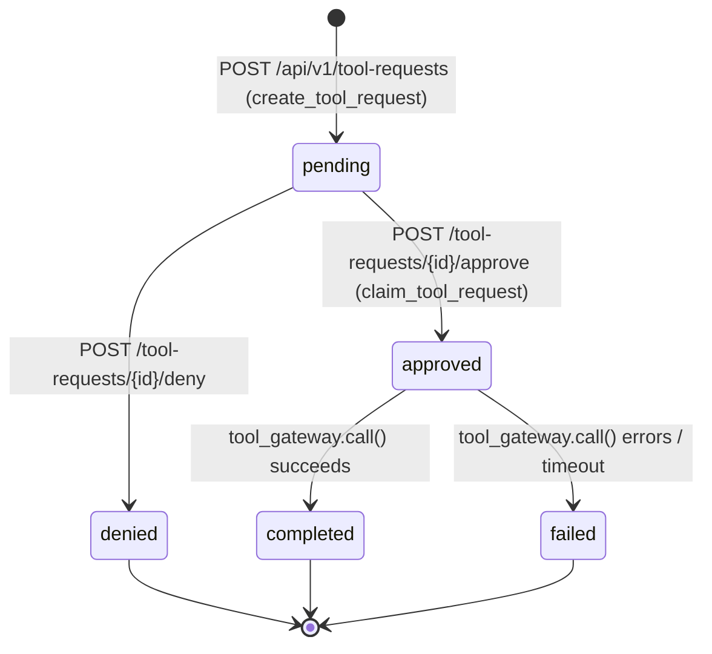

# Local AI Chat Studio — Architecture Reference

> **Snapshot:** branch `main` · commit `5dc6b6f` · 2026-08-17
> Generated by doc-and-modernize Documentation mode from the local checkout.

---

## Part 1 — Whole-Repo Technical Deep-Dive

### What the repository is

Local AI Chat Studio is a self-hosted, browser-based AI chat application designed to run entirely on a user's own machine. It ships one binary-compatible URL (`http://127.0.0.1:8506`) that serves both a REST/SSE API and a React SPA from a single Uvicorn process. Users bring their own API keys for cloud providers; local Ollama models require no key. All conversation history, memories, uploads, and settings are stored in a local SQLite database (`data/app.db`). The project description calls it "a local-first, ChatGPT-style AI chat studio over Ollama with optional BYOK cloud providers, built-in memory, and self-improving personalization." (`pyproject.toml:4`)

---

### Tech-Stack Detection Table

| Layer | Technology | Evidence |
|---|---|---|
| Backend language | Python 3.12 | `.python-version:1`, `pyproject.toml:8` (`requires-python = ">=3.12"`) |
| Backend framework | FastAPI 0.139.2+ | `pyproject.toml:11` |
| Backend server | Uvicorn 0.49.0+ | `pyproject.toml:25`, `backend/app/cli.py:4` |
| Dependency manager | uv (portable, bundled) | `uv.lock` present; launchers download uv to `.runtime/` |
| Frontend language | TypeScript 5.9.x | `frontend/package.json:devDependencies.typescript` |
| Frontend framework | React 19.2.x | `frontend/package.json:dependencies.react` |
| Frontend router | React Router 8.3.0 | `frontend/package.json:dependencies.react-router` |
| Frontend bundler | Vite 8.1.x | `frontend/package.json:devDependencies.vite` |
| Frontend styling | Tailwind CSS v4 | `frontend/package.json:dependencies.tailwindcss` |
| Frontend UI primitives | Base UI React 1.6.x | `frontend/package.json:dependencies.@base-ui/react` |
| Frontend test runner | Vitest 4.x | `frontend/package.json:devDependencies.vitest` |
| Frontend linter | oxlint 1.x | `frontend/package.json:scripts.lint` |
| Frontend API codegen | openapi-typescript 7.x | `frontend/package.json:scripts.generate:api` |
| Backend linter | ruff | `pyproject.toml:dev` group |
| Backend test framework | pytest + pytest-asyncio | `pyproject.toml:dev` group |
| Primary data store | SQLite (via stdlib `sqlite3`) | `backend/app/store.py:8`, schema at `store.py:44` |
| Optional vector store | ChromaDB 1.5.9+ | `pyproject.toml:9`; used only if `CHAT_EMBED_MODEL` is set |
| HTTP client | httpx + httpx2 | `pyproject.toml:14`; `backend/app/mcp_tools.py:8` |
| MCP client | mcp 2.x | `pyproject.toml:16`; `backend/app/mcp_tools.py:15-16` |
| Markdown rendering | react-markdown, rehype-highlight, remark-math, KaTeX | `frontend/package.json:dependencies` |
| Diagram rendering | mermaid 11.16.1 | `frontend/package.json:dependencies.mermaid` |

---

### Entry Points

| Component | Entry point | How to invoke |
|---|---|---|
| Python CLI (production) | `backend.app.cli:main` | `uv run chat-studio` — installs as `chat-studio` script (`pyproject.toml:30`) |
| Backend app factory | `backend.app.main:create_app()` | Imported by CLI and test client (`create_app(database_url=":memory:")`) |
| Frontend dev server | `frontend/` | `npm run dev` (Vite, `frontend/package.json:scripts.dev`) |
| Frontend production build | `frontend/dist/` | `npm run build` — output mounted by SPAStaticFiles at `/` (`main.py:1172-1174`) |
| Windows launcher | `Launch Chat Studio.cmd` | Double-click; embeds a PowerShell script that manages uv + Node setup |
| Linux launcher | `Launch Chat Studio.sh` | `bash 'Launch Chat Studio.sh'`; pure Bash + portable uv + Node |

---

### Commands & Verification Inventory

| Command | Purpose | Evidence |
|---|---|---|
| `uv sync --locked --dev` | Install all Python deps from lockfile | `pyproject.toml`; CI `backend` job |
| `uv run chat-studio` | Start production server (127.0.0.1:8506) | `backend/app/cli.py:8-23` |
| `uv run python -m pytest -q` | Run all backend tests | CI `backend` job, `.github/workflows/ci.yml:26` |
| `uv run ruff check backend tests` | Lint Python code | CI `backend` job, `ci.yml:27` |
| `cd frontend && npm ci` | Install frontend deps from lockfile | CI `frontend` job, `ci.yml:41` |
| `cd frontend && npm run lint` | Lint TypeScript/React (oxlint) | `frontend/package.json:scripts.lint`; CI `ci.yml:42` |
| `cd frontend && npm test` | Run Vitest frontend tests | `frontend/package.json:scripts.test`; CI `ci.yml:43` |
| `cd frontend && npm run build` | Build static frontend into `frontend/dist/` | `frontend/package.json:scripts.build`; CI `ci.yml:44` |
| `cd frontend && npm run generate:api` | Re-generate `frontend/src/api/schema.ts` from `openapi.json` | `frontend/package.json:scripts.generate:api` |
| `uv run python scripts/generate_api_types.py` | Write/refresh `openapi.json` from FastAPI app | `scripts/generate_api_types.py`; called as part of `generate:api` |
| `'./Launch Chat Studio.cmd' --check` | Windows: run CI health check without installing | CI `launcher-windows` job, `ci.yml:12` |
| `bash './Launch Chat Studio.sh' --check` | Linux: run CI health check without installing | CI `backend` job, `ci.yml:23` |
| `bash -n './Launch Chat Studio.sh'` | Syntax-check the launcher (CI) | CI `backend` job, `ci.yml:22` |

**CI workflow:** `.github/workflows/ci.yml` — triggers on every `push` and `pull_request`. Three parallel jobs: `launcher-windows` (windows-latest), `backend` (ubuntu-latest), `frontend` (ubuntu-latest).

**CI enforcement:** [UNVERIFIED] — branch-protection rules that would make these jobs *required* status checks cannot be determined from the local checkout. As of this writing the CI merely runs on all branches/PRs; whether merges are blocked on failure is a manual repository-settings decision.

---

### Directory Layout

```
local-ai-chat-studio/
├── backend/
│   └── app/             # Core FastAPI application package
│       ├── cli.py        # Entry-point: uvicorn.Server wrapper
│       ├── main.py       # create_app() factory, all 76 route handlers, 2 middlewares
│       ├── contracts.py  # Pydantic models shared between routes and store
│       ├── store.py      # SQLite persistence layer (1811 lines, 83 methods)
│       ├── providers.py  # ProviderAdapter hierarchy + ProviderRegistry
│       ├── sessions.py   # SessionVault (in-memory credential store), PROVIDER_ENV
│       ├── runs.py       # RunManager — async streaming execution + event emitting
│       ├── mcp_tools.py  # McpGateway protocol + DefaultMcpGateway (stdio & HTTP)
│       ├── workspace.py  # Context assembly, safety scanning, web search (694 lines)
│       ├── memory.py     # Memory extraction LLM workflow
│       └── pricing.py    # Official per-model price table (per-million token rates)
├── src/                  # Standalone Python utilities (not a package in the DI sense)
│   ├── files.py          # File parsing: PDF, DOCX, Excel, images → text/base64
│   ├── rag.py            # Optional ChromaDB indexing/retrieval (CHAT_EMBED_MODEL)
│   ├── ollama_client.py  # Simple Ollama health + running-models probe
│   ├── config.py         # Settings (pydantic-settings)
│   ├── catalog.py        # Static model catalog metadata
│   ├── model_labels.py   # Human-readable model name mapping
│   └── ...               # orchestrator, personalization, jobs, etc.
├── frontend/
│   ├── src/
│   │   ├── App.tsx        # Root component: layout, navigation, SPA routing
│   │   ├── routes/        # Page-level components (chat, compare, context, evidence, focus, library, replay, settings)
│   │   ├── features/      # Domain feature slices (conversations, messages, models, attachments, tools, context, knowledge, etc.)
│   │   ├── api/           # Generated TypeScript API client (schema.ts from openapi.json)
│   │   ├── app/           # App-level config: routes.ts, RouteErrorBoundary
│   │   ├── components/    # UI primitives (ui/, MarkdownContent, shared/)
│   │   ├── hooks/         # React hooks (useMediaQuery, useWorkspacePreferences, etc.)
│   │   ├── state/         # Global state slices
│   │   └── lib/           # Pure utilities
│   ├── public/            # Static assets served at root
│   ├── dist/              # Production build output (mounted by SPAStaticFiles)
│   ├── package.json       # Frontend manifest
│   └── vite.config.ts     # Vite configuration
├── tests/                 # Backend pytest suite (5 files)
│   ├── conftest.py        # `client` fixture (in-memory SQLite TestClient)
│   ├── test_api_contract.py
│   ├── test_mcp_tools.py
│   ├── test_pricing.py
│   ├── test_provider_adapters.py
│   └── test_workspace_features.py
├── scripts/
│   └── generate_api_types.py   # Writes openapi.json from FastAPI app introspection
├── data/                  # Runtime data (gitignored in practice)
│   ├── app.db             # SQLite database (primary store)
│   ├── chroma/            # ChromaDB vector store (optional, only with CHAT_EMBED_MODEL)
│   ├── uploads/           # Uploaded file blobs
│   └── v2/studio.db       # Legacy v2 database (for import only)
├── docs/                  # Additional documentation
├── src/                   # Python utilities (files, rag, ollama_client, etc.)
├── pages/                 # [Legacy / unused — investigation needed]
├── Launch Chat Studio.cmd # Windows launcher (325 lines, cmd + embedded PowerShell)
├── Launch Chat Studio.sh  # Linux launcher (371 lines, pure Bash)
├── pyproject.toml         # Python project manifest + uv config
├── uv.lock                # Pinned Python dependency lockfile
├── openapi.json           # Generated OpenAPI 3.x spec (143 KB, 76 routes)
├── .env.example           # Documented env var names (no credential values)
└── .github/
    ├── workflows/ci.yml   # CI pipeline (push + PR, 3 jobs)
    └── ISSUE_TEMPLATE/    # Bug report + feature request templates
```

---

### Deployment & Runtime Surface

| Pin location | Pinned item | Value | Evidence |
|---|---|---|---|
| `.python-version` | Python interpreter | `3.12` | `.python-version:1` |
| `pyproject.toml` | Python minimum | `>=3.12` | `pyproject.toml:8` |
| `uv.lock` | All Python packages | Locked at install time | `uv.lock` (committed) |
| `Launch Chat Studio.cmd` | Node.js (Windows) | Current LTS, resolved at install time via Node.js API | launcher logic, `Launch Chat Studio.cmd:200` |
| `Launch Chat Studio.sh` | Node.js (Linux) | Current LTS, resolved at install time via Node.js API | launcher logic, `Launch Chat Studio.sh:259` |
| `.github/workflows/ci.yml` | Node.js (CI) | `22.12` | `ci.yml:39` (`actions/setup-node@v4 node-version: "22.12"`) |
| `.github/workflows/ci.yml` | Python (CI) | `3.12` | `ci.yml:19` (`astral-sh/setup-uv@v6 python-version: "3.12"`) |
| `pyproject.toml:9` | ChromaDB | `>=1.5.9` | optional; only loaded when `CHAT_EMBED_MODEL` is set |
| `data/app.db` | SQLite (stdlib) | Python built-in, no separate service | `backend/app/store.py:8` |
| N/A | Docker / containers | **None** — no Dockerfile, no docker-compose | root directory listing |

**Drift note:** The CI runner pins Node `22.12` exactly, but the launchers resolve to the current Node.js LTS at first-run install time. If the LTS changes, the installed version may differ from what CI used. [INFERRED: this is a documented tradeoff — the launchers intentionally stay on current LTS rather than pinning a specific patch.]

---

### EOL / Dead-Dependency Scan

| Item | Status | Notes |
|---|---|---|
| Python 3.12 | Active (EOL Oct 2028) | No action needed |
| React 19 | Active (latest as of 2026) | No action needed |
| FastAPI 0.139 | Active | No action needed |
| Vite 8.x | Active | No action needed |
| Tailwind CSS v4 | Active | No action needed |
| React Router 8.x | Active | No action needed |
| `httpx2` (not standard `httpx`) | [INFERRED: unknown provenance] | `pyproject.toml:14` pins `httpx2>=2.10.0,<3`; used only in `mcp_tools.py` for the Streamable HTTP MCP transport. Verify this is a maintained fork/successor before upgrading. |
| `ddgs` (DuckDuckGo search) | Active | `pyproject.toml:10`; used in `workspace.py:search_web` |
| SQLite (stdlib) | Perpetually maintained as Python stdlib | No concern |
| ChromaDB 1.5.9 | Active | No concern at current version |
| mcp 2.x | Active (Anthropic-maintained) | No concern |
| `xlrd 2.x` | [INFERRED] Maintained for `.xls` only; `.xlsx` is handled by `openpyxl` | Narrow scope; no removal needed |

---

### Data / Storage Layers

| Store | Technology | Location | Purpose |
|---|---|---|---|
| Primary DB | SQLite (stdlib) | `data/app.db` (overrideable via `CHAT_DATA_DIR`) | All conversations, messages, runs, memories, uploads metadata, MCP servers, backpacks, presets, knowledge bases, provider policies, focus sessions |
| File blobs | Filesystem | `data/uploads/` | Raw upload bytes (up to 10 MB each) |
| Vector store | ChromaDB | `data/chroma/` | Optional memory + knowledge base RAG; only active when `CHAT_EMBED_MODEL` is set |
| MCP sandboxes | Filesystem | `data/mcp-sandboxes/{server_id}/` | Working directory for each stdio MCP server process |
| Session vault | In-memory | `SessionVault` instance (heap) | API keys entered via the browser UI; cleared on process restart |
| Run state | In-memory | `RunManager._runs` dict | Active/completed run streaming state; persisted to SQLite on completion |

---

### API

The FastAPI application exposes **76 route handlers** across the `/api/v1/` prefix plus a wildcard SPA catch-all at `/`. Key resource groups:

| Group | Route prefix | Count |
|---|---|---|
| Conversations & messages | `/api/v1/conversations` | ~10 |
| Runs (streaming AI turns) | `/api/v1/runs`, `/api/v1/activity` | 8 |
| Providers & credentials | `/api/v1/providers` | ~14 |
| MCP servers & tools | `/api/v1/mcp`, `/api/v1/tool-requests` | 8 |
| Memories | `/api/v1/memories` | 5 |
| Uploads | `/api/v1/uploads` | 3 |
| Knowledge bases | `/api/v1/knowledge-bases` | 4 |
| Backpacks | `/api/v1/backpacks` | 4 |
| Focus sessions | `/api/v1/focus-sessions` | 3 |
| Presets | `/api/v1/presets` | 3 |
| Profile | `/api/v1/profile` | 2 |
| Data (export/import/wipe) | `/api/v1/data` | 4 |
| Safety | `/api/v1/safety` | 1 |
| Runtime (health/shutdown) | `/api/v1/runtime` | 2 |
| Streaming (SSE) | `/api/v1/runs/{run_id}/events` | 1 |

The OpenAPI spec is committed at `openapi.json` (143 KB). The TypeScript client at `frontend/src/api/schema.ts` is generated from it via `npm run generate:api`. **Changing `contracts.py` requires re-running `npm run generate:api` and committing the updated `schema.ts`.**

---

### Background Jobs / Async Work

All async work runs inside the single Uvicorn event loop (no Celery/RQ/worker processes):

| Job | Mechanism | Evidence |
|---|---|---|
| AI streaming run | `asyncio.create_task` via `RunManager.create()` | `runs.py:64` |
| Web search (DuckDuckGo) | `asyncio.to_thread(search_web, ...)` | `main.py:160` |
| Memory index sync | `asyncio.to_thread` in lifespan-managed background | `main.py:168-179` |
| Ollama health probe | `asyncio.gather(to_thread(ollama_alive), to_thread(running_models))` | `main.py:362-366` |
| MCP tool execution | `asyncio.timeout(30)` + `tool_gateway.call()` | `mcp_tools.py:130` |
| Provider model discovery | `asyncio.gather` over all adapters | `providers.py:625-631` |

---

### CI/CD

CI runs on GitHub Actions (`.github/workflows/ci.yml`). Three jobs run in parallel:

1. **`launcher-windows`** (`windows-latest`): runs `Launch Chat Studio.cmd --check` — validates the Windows launcher syntax and setup flow.
2. **`backend`** (`ubuntu-latest`): bash-lints the Linux launcher, runs `--check`, syncs Python deps, runs pytest + ruff.
3. **`frontend`** (`ubuntu-latest`): npm ci, oxlint, vitest, npm build.

No CD / deployment pipeline is present in this repository [INFERRED: self-hosted; users run locally].

---

### Testing

| Suite | Files | Runner | Coverage |
|---|---|---|---|
| Backend integration | `tests/test_api_contract.py` | pytest (TestClient, in-memory SQLite) | API contract surface: SPA fallback, health, session cookie, conversations, messages, runs, uploads, memories, MCP, backpacks, data import/wipe, etc. |
| Backend unit | `tests/test_pricing.py` | pytest | Pricing table correctness; custom gateway suppression |
| Backend unit | `tests/test_provider_adapters.py` | pytest | Provider adapter stream/list behaviours (mocked) |
| Backend unit | `tests/test_mcp_tools.py` | pytest | MCP gateway redaction, URL validation |
| Backend unit | `tests/test_workspace_features.py` | pytest | Context assembly, safety scanning |
| Frontend | `frontend/src/**/*.test.tsx` | Vitest + Testing Library | Component-level tests; `App.test.tsx`, `MarkdownContent.test.tsx` |

Test fixture (`conftest.py:4-9`): a `TestClient` wrapping `create_app(database_url=":memory:")` — the in-memory SQLite means tests are isolated and leave no files on disk.

---

## Part 2 — Context & Ecosystem

### Local Checkout Identity

| Field | Value |
|---|---|
| Remote | `https://github.com/pypi-ahmad/local-ai-chat-studio.git` |
| Branch | `main` |
| HEAD commit | `5dc6b6f31e6507e1288af992430df0b0dcc07693` |
| Version | `0.7.13` (`pyproject.toml:3`) |
| License | MIT (`LICENSE`) |
| Snapshot date | 2026-08-17 |

---

### Contributor / Agent Docs Present

| File | What it encodes |
|---|---|
| `CONTRIBUTING.md` | Contribution workflow, PR checklist, no-financial-support statement, data responsibility note |
| `.github/pull_request_template.md` | PR checklist including: contracts regen step, no-credentials check, pricing source citation requirement |
| `.github/ISSUE_TEMPLATE/bug_report.md` | Structured bug report template with env table, terminal output section |
| `.github/ISSUE_TEMPLATE/feature_request.md` | Feature request template with audience/context fields |
| `SECURITY.md` | Vulnerability disclosure policy |
| `SUPPORT.md` | Where to get help; no-paid-support statement |
| `DISCLAIMER.md` | Data ownership, API cost responsibility, no warranty |
| `CODE_OF_CONDUCT.md` | Community standards |
| `TECHNICAL.md` | Reference documentation (configuration, API, schema) |
| `USAGE.md` | How-to guide (Diátaxis How-to quadrant) |
| `USER_GUIDE.md` | Extended usage guide |
| `CODE_TUTORIAL.md` | Developer tutorial (39 KB) |
| `ZERO_TO_HERO_STUDY_HANDBOOK.md` | Study/learning guide (38 KB) |
| `CHANGELOG.md` | Release history |

---

### Developer Gotchas

1. **Contracts change requires API regeneration** — any edit to `backend/app/contracts.py` that alters the public API schema must be followed by `npm run generate:api` in `frontend/`, then `root openapi.json` must be deleted, and the new `frontend/src/api/schema.ts` committed. The PR checklist explicitly calls this out. (`frontend/package.json:scripts.generate:api`)

2. **SessionVault is in-memory only** — credentials entered via the browser UI are stored in `SessionVault` (a heap-resident dict). They are **never persisted** to disk, so a server restart clears all browser-entered API keys. This is by design. (`backend/app/sessions.py:24-74`)

3. **`PROVIDER_ENV` must cover every adapter** — at app startup `create_app()` compares `registry.adapters` keys against `PROVIDER_ENV`. If any adapter is registered without a matching `PROVIDER_ENV` entry, the app raises `RuntimeError` and refuses to start. (`main.py:133-139`)

4. **Frontend dist must exist for the app to serve the UI** — `SPAStaticFiles` is only mounted if `frontend/dist/` exists (`main.py:1172-1173`). Running `uv run chat-studio` without a prior `npm run build` serves the API but returns 404 for all browser routes.

5. **`receipthash` chain** — runs accumulate a SHA256 receipt chain (`runs.py:209-222`) for tamper-evidence. The chain depends on insertion order; wiping the database (`POST /api/v1/data/wipe`) resets it.

6. **MCP stdio isolation is process-level only** — `DefaultMcpGateway` runs stdio MCP servers in a per-server sandbox directory (`data/mcp-sandboxes/{server_id}/`) with an env whitelist (`mcp_tools.py:84-93`), but there is no OS-level sandbox (no seccomp, no container). The USAGE.md explicitly warns: "Local stdio isolation is not a substitute for an OS sandbox."

7. **ChromaDB is lazily imported** — `src/rag.py` is only imported at runtime if `CHAT_EMBED_MODEL` is set. Setting the env var without installing `chromadb` will cause an `ImportError` at first memory index operation (not at startup).

8. **Web search is fire-and-forget** — `search_web()` uses DuckDuckGo (`ddgs` library) with no API key. Provider failures return an empty list (no context), not an error. (`workspace.py:79-80`)

9. **Frontend lint is oxlint, not ESLint** — the linter is `oxlint` (Rust-based), not ESLint. Developers who expect ESLint rules/plugins will not find them.

10. **`httpx2`** — the MCP Streamable HTTP transport uses `httpx2`, not the standard `httpx`. This is a separate package (`pyproject.toml:14`). Do not confuse with `httpx` used by providers.

---

### Ecosystem Relations

- **Ollama** — local model server; the app discovers and streams from it via the `ollama` Python SDK. `CHAT_OLLAMA_HOST` defaults to `http://localhost:11434`. Ollama is optional but is the "default local model provider."
- **OpenCode** — a separate, locally-running OpenCode server (`http://127.0.0.1:4096`) provides an OAuth bridge for ChatGPT, SuperGrok, and Claude subscription sign-in. The bridge adapter (`providers.py:439-593`) proxies SSE from the OpenCode `/event` endpoint. The loopback-only constraint is enforced at adapter construction (`providers.py:450-455`).
- **OpenRouter** — the app implements a full PKCE OAuth flow for OpenRouter keys, storing the code verifier in `oauth_verifiers` (a 600-second TTL in-memory dict; `main.py:129`).
- **MCP protocol** — the app is an MCP *client*, not a server. It connects to user-configured MCP servers via stdio or HTTPS Streamable HTTP (`mcp_tools.py`).

---

## Part 3 — Architectural Blueprint

### Tech-Stack Summary

Single-process architecture: one Uvicorn server hosts both the REST/SSE backend (FastAPI) and the compiled React SPA (SPAStaticFiles). There are no separate worker processes, message queues, or external caches. All state is either in-process heap (session vault, run manager) or on-disk SQLite/filesystem. The design is explicitly local-first.

---

### C4 Diagrams

#### Level 1 — System Context



#### Level 2 — Containers



#### Level 3 — Chat Turn Lifecycle



---

### Layering & Dependency Rules

```
frontend/src/api/        ← generated from openapi.json; do NOT edit manually
frontend/src/routes/     → features/ → components/ui/, hooks/, lib/
backend/app/main.py      → store, providers, sessions, runs, workspace, mcp_tools, memory
backend/app/runs.py      → providers, sessions, store, contracts
backend/app/workspace.py → store, contracts, src/rag (optional)
backend/app/providers.py → contracts, pricing
backend/app/store.py     → contracts, mcp_tools (redact_value only)
backend/app/memory.py    → contracts, providers, src/files
src/                     → no backend/app imports; standalone utilities
```

**Rule:** `backend/app/` modules never import from `frontend/`. `src/` modules never import from `backend/app/`. `frontend/src/api/schema.ts` is generated — never edit it by hand.

---

### Cross-Cutting Concerns

| Concern | Mechanism | Location |
|---|---|---|
| **Auth** | HTTP-only `chat_session` cookie (session id); API keys held in `SessionVault` (in-memory, per session); no user accounts | `main.py:202-212` (middleware), `sessions.py` |
| **API key source priority** | session vault → `PROVIDER_ENV` env var → Anthropic WIF | `sessions.py:45-60` |
| **Anthropic WIF** | `_anthropic_wif_configured()` checks `ANTHROPIC_PROFILE` or (RULE_ID + ORG_ID + SERVICE_ACCOUNT_ID + identity token) | `sessions.py:63-74` |
| **Config** | Environment variables; no config files at runtime; `.env.example` documents names | `.env.example`, `backend/app/sessions.py`, `main.py:125` |
| **Logging** | Python stdlib `logging`; Loguru used in `src/` | `main.py:97`, `src/files.py` |
| **Metrics/tracing** | `metrics` dict on `RunSnapshot` (elapsed_seconds); no APM | `runs.py:148-151` |
| **Secrets** | Never persisted; only in heap (`SessionVault`); regex-based scrubbing before MCP result storage | `mcp_tools.py:28-49`, `sessions.py` |
| **Error handling** | `KeyError` → 404, `RuntimeError` → 409/503, `ValueError` → 422; provider errors sanitized to safe string | `main.py` (all routes), `runs.py:173-182` |
| **Security headers** | `X-Content-Type-Options: nosniff`, `X-Frame-Options: DENY`, `Referrer-Policy: strict-origin-when-cross-origin` | `main.py:194-200` |
| **Safety scanning** | Regex patterns for secrets, PII, prompt injection; findings attached to `ContextPlan`; memories quarantined on injection | `workspace.py:22-75`, `main.py:799-815` |
| **Feature flags** | None (no runtime flags) | — |
| **CORS** | Not configured (single-origin: loopback only) | [INFERRED: no CORS middleware present] |
| **Context budget** | Token estimation in `build_context_plan`; turns over budget are rejected (422) | `workspace.py`, `main.py:489-496` |

---

### Inferred Architectural Decision Records

#### ADR-1: Single-process, no worker queue
**Context:** AI streaming runs can take seconds to minutes. The app needed to handle concurrent requests without blocking.
**Decision:** All runs execute as `asyncio.Task`s in the single Uvicorn event loop. `RunManager` holds in-memory state; results are persisted to SQLite synchronously on completion.
**Alternatives considered:** Celery + Redis worker queue; separate async worker process.
**Consequences:** Simplicity — no extra infrastructure; but concurrent run count is limited by the event loop and Python's GIL for CPU-bound work. Restart clears all in-flight runs.

#### ADR-2: SessionVault is in-memory only
**Context:** API keys are sensitive and must not be written to disk.
**Decision:** `SessionVault` holds credentials in a plain `dict[session_id, dict[provider, key]]` guarded by an `RLock`. Keys entered via the browser UI are never persisted.
**Alternatives considered:** Encrypted on-disk vault.
**Consequences:** Zero persistence risk for credentials; restart logs out all browser-entered keys. Users must re-enter keys after restart (unless they use environment variables).

#### ADR-3: OpenAPI-generated TypeScript client
**Context:** Maintaining a hand-written TypeScript API layer was error-prone.
**Decision:** `openapi.json` is generated at development time from FastAPI introspection and committed. `frontend/src/api/schema.ts` is generated from it via `openapi-typescript`. Both files are committed.
**Consequences:** Frontend and backend stay type-safe; changing contracts requires regenerating and committing two files. Skipping regeneration breaks type safety silently.

#### ADR-4: MCP clients, not MCP servers
**Context:** Users want to use external tools (file system, web search, etc.) from the chat UI.
**Decision:** The app acts as an MCP *client*; users configure external MCP servers. Tool execution requires explicit per-request browser approval with a reason.
**Consequences:** The app has no tool capability of its own; tool security depends on external servers. Approval gate prevents automatic tool invocation.

#### ADR-5: No CORS, loopback-only
**Context:** Running on `127.0.0.1` means only the local browser can reach the app.
**Decision:** No CORS headers; `OpenCodeBridgeAdapter` enforces a loopback-only URL at construction time.
**Consequences:** The app cannot be used as a shared network service. Any attempt to expose it on a non-loopback interface breaks the OpenCode bridge guard.

#### ADR-6: Preflight / plan-hash interlocking
**Context:** Context assembles asynchronously (web search, RAG, memory); the actual turn must use the same context the user saw in the preflight response.
**Decision:** `build_context_plan` returns a `plan_hash` (SHA256 of context). The `TurnCreate` request must include this hash; if context changed between preflight and turn, the server returns 409 with the updated plan.
**Alternatives considered:** Re-assemble context on turn submission.
**Consequences:** Reliable context consistency; two round trips required (preflight + turn); web search results are cached in a bounded LRU dict (128 entries, `main.py:163-165`).

---

### Governance & Enforcement Mechanisms

| Mechanism | What it enforces |
|---|---|
| `PROVIDER_ENV` completeness check at startup | Every registered provider adapter must have a credential-env entry; prevents 404s on live providers |
| `plan_hash` interlocking (409 on context change) | Prevents stale context from being sent to a model |
| Budget check (422 on over-budget) | Prevents requests that would exceed the model's context window |
| `confirmed_finding_ids` check (409 on unconfirmed safety findings) | Forces UI to surface safety warnings before sending |
| MCP URL validation (`_public_remote_url`) | Remote MCP servers must use HTTPS and resolve to a public IP |
| `X-Local-Studio: shutdown` header check | Prevents the shutdown endpoint from being called by anything except the local UI |
| `contracts.py` → `openapi.json` → `schema.ts` chain | Type safety between backend and frontend; enforced by PR checklist |
| CI on push+PR | Runs lint, tests, build on every change; enforcement (required status checks) is [UNVERIFIED] |

---

### How to Add a Feature

1. **Add/update Pydantic models** in `backend/app/contracts.py` for any new request/response shapes.
2. **Add store methods** in `backend/app/store.py` if the feature needs persistence; update the `SCHEMA` string for any new tables.
3. **Add route handlers** in `backend/app/main.py` inside `create_app()`. New handlers have access to `store`, `vault`, `runs`, `registry`, and `tool_gateway` via closure.
4. **Re-generate the API client:** `cd frontend && npm run generate:api`. Delete the root `openapi.json` first (it is regenerated by the script). Commit both the new `openapi.json` and the updated `frontend/src/api/schema.ts`.
5. **Add frontend feature slice** in `frontend/src/features/<domain>/`. Wire it into `App.tsx` or an existing route.
6. **Add a new route page** in `frontend/src/routes/<page>/` and register it in `frontend/src/app/routes.ts`.
7. **Write backend tests** in `tests/` using the `client` fixture from `conftest.py`. Write frontend tests in `frontend/src/**/*.test.tsx`.

**Common pitfalls:**
- Forgetting to re-run `generate:api` after changing `contracts.py`.
- Adding a provider adapter without adding it to both `build_provider_registry()` (`providers.py:638-671`) AND `PROVIDER_ENV` (`sessions.py:8-21`).
- Writing to `SessionVault` expecting persistence across restarts.
- Referencing `frontend/dist/` assets during development (use `npm run dev` instead).
- Using `httpx` in place of `httpx2` for MCP Streamable HTTP transport.

---

## Subsystem Deep-Dives

### Subsystem 1: Provider & Session Management

The provider subsystem manages 12 AI backend adapters and the in-session credential vault that routes API keys to them.

**Architecture:**

```
SessionVault (sessions.py)
  ├── _values: dict[session_id, dict[provider_id, api_key]]   ← browser-entered keys
  └── .get(session_id, provider) → str | None
        priority: session vault → PROVIDER_ENV env var → Anthropic WIF

ProviderRegistry (providers.py:596-635)
  ├── adapters: dict[str, ProviderAdapter]
  ├── .discover_models(credential_fn)  → concurrent gather over all adapters
  └── .supports_images(provider, model) → bool | None

ProviderAdapter (ABC)
  ├── .list_models(api_key) → list[ModelDescriptor]
  └── .stream(api_key, model, messages, temperature, reasoning_effort) → AsyncIterator[str]
```

**Adapter taxonomy:**

| Adapter | Protocol | Key notes |
|---|---|---|
| `OllamaAdapter` (×2) | Ollama REST | `cloud=False` (local): `auth_modes=("none",)`, no key required |
| `OpenAICompatibleAdapter` (×5) | OpenAI Chat Completions | Used for openai, agnes, openrouter, xai, omniroute |
| `AnthropicAdapter` | Anthropic Messages API | `auth_modes=("api_key","wif")`; WIF uses workload identity tokens |
| `GeminiAdapter` | Google Gemini `generateContentStream` | Uses `google-genai` SDK |
| `OpenCodeZenAdapter` | Multi-protocol fan-out | Detects model family (GPT → OpenAI Responses API; Claude/Qwen → Anthropic; Gemini → raw HTTPS; others → OpenAI Chat) |
| `OpenCodeBridgeAdapter` | OpenCode REST + SSE | Creates a temporary OpenCode session, streams `/event`, deletes session on exit |

**Key lifecycle (stream):**

```mermaid
flowchart TD
  A[RunManager._execute] --> B{provider == 'echo'?}
  B -- yes --> C[_echo: yield tokens with asyncio.sleep between]
  B -- no --> D[registry adapter = providers[request.provider]]
  D --> E[vault.get(session_id, provider) → api_key]
  E --> F[adapter.stream(api_key, model, messages, temp, effort)]
  F --> G[async for delta in stream]
  G --> H{cancel.is_set?}
  H -- yes --> I[status = cancelled; emit run.cancelled]
  H -- no --> J[snapshot.output += delta; emit run.delta]
  J --> G
  G -- exhausted --> K[status = completed; add assistant message; emit run.completed]
```

**Session vault credential priority** (`sessions.py:45-60`):
1. Browser-entered key (in `_values` dict)
2. Environment variable named in `PROVIDER_ENV`
3. Anthropic WIF (only for provider `"anthropic"`)

---

### Subsystem 2: MCP Tool-Call Pipeline

The MCP subsystem manages user-configured tool servers and enforces an explicit human-approval gate before any tool executes.

**State machine per tool request:**



**Key security properties:**
- `create_tool_request`: validates arguments against the tool's JSON Schema (`Draft202012Validator`) before storing — malformed arguments are rejected at submission, not at execution (`main.py:269-270`).
- `claim_tool_request`: atomic claim using `store.session_hash(session_id)` — only the session that created the request can approve it.
- `safe_result_preview`: before storing MCP results, `redact_value()` strips keys matching `authorization|cookie|credential|password|secret|token|api[_-]?key` and inline secret patterns (`mcp_tools.py:40-57`). Raw arguments are removed from storage after decision.
- Transport isolation: `_public_remote_url()` refuses any URL that resolves to a private/reserved IP (`mcp_tools.py:60-75`). Stdio servers get their own working directory with an env whitelist.

**Transport implementations** (`DefaultMcpGateway`):
- `stdio`: `mcp.Client(StdioServerParameters)` with `read_timeout_seconds=30` and an env allowlist (PATH, PATHEXT, SYSTEMROOT, WINDIR + server-declared `env_keys`)
- `streamable_http`: `httpx2.AsyncClient` → `streamable_http_client` → `ClientSession` (MCP SDK)

---

### Subsystem 3: Context Assembly & Safety (workspace.py)

Before any AI turn is sent, the `build_context_plan` function assembles a budget-aware context plan and scans all content for safety findings.

**Context sources (in priority order):**
1. System prompt (from conversation settings or profile)
2. Active memories (from memory store; optionally RAG-retrieved if `CHAT_EMBED_MODEL` is set)
3. Knowledge base (bound to conversation; files, backpack items, related-chat excerpts)
4. Active backpack items
5. Uploaded file attachments (conversation-scoped)
6. Recent conversation history (last 8 messages verbatim; older messages compressed to a summary of ≤3200 chars — `workspace.py:29-45`)
7. Web search results (DuckDuckGo, if `include_web=True` in conversation settings)

**Token budget:**
- Controlled by `TurnPreflight.context_limit` (default 8192, max 2,000,000 tokens — `contracts.py:216`)
- Each section reports `estimated_tokens`; the plan calculates total vs budget
- Over-budget turns are rejected with 422; the UI shows exact percentage and warns at 80%

**Safety scanning** (`workspace.py:22-75`):
- **Secrets:** regex patterns for `sk-*`/`sk-ant-*` (OpenAI/Anthropic keys), GitHub tokens, private keys, JWTs
- **PII:** email addresses and phone numbers
- **Prompt injection:** patterns like "ignore previous instructions", "reveal the system prompt", "act as the system"

Findings are attached to `ContextPlan.findings`. If any finding is present, `requires_confirmation=True` and the turn create endpoint returns 409 until the UI confirms the findings by including their IDs in `TurnCreate.confirmed_finding_ids`.

**Plan hash interlocking:**
```python
plan_hash = sha256(json.dumps(all_source_ids_and_content_hashes, sort_keys=True)).hexdigest()
```
Web search results are cached by plan_hash in `web_by_plan` (bounded at 128 entries). The turn submission must include the plan_hash from preflight; if context changed between preflight and turn (e.g., a new memory was added), the server rejects with 409 and returns the updated plan.

---

## Confidence Assessment

| Claim area | Confidence | Notes |
|---|---|---|
| Python version, package versions | **High** | Read directly from `.python-version`, `pyproject.toml`, `uv.lock` |
| Route count (76) | **High** | Counted from `grep "@app\." backend/app/main.py` output |
| Provider adapter list (12) | **High** | Read from `build_provider_registry()` in `providers.py:638-671` |
| SQLite schema | **High** | Read from `SCHEMA` literal in `store.py:44` |
| SessionVault credential priority | **High** | Read from `sessions.py:45-60` |
| CI trigger (push + PR) | **High** | Read from `ci.yml` |
| CI enforcement (required status checks) | **Unverified** | Cannot be determined from local checkout; requires GitHub repo settings |
| Node.js version in launchers | **Inferred** | Launchers resolve current LTS dynamically; CI pins 22.12 |
| `httpx2` provenance | **Inferred** | Package is used but its maintenance status relative to `httpx` is not clear from disk |
| ChromaDB usage | **High** | Code clearly guards on `CHAT_EMBED_MODEL`; lazy import confirmed |
| Receipt hash chain tamper-evidence | **High** | Algorithm read from `runs.py:209-222` |
| MCP security properties | **High** | Read from `mcp_tools.py:60-93`, `main.py:264-280` |
| Frontend route structure | **High** | Listed from `frontend/src/routes/` directory |
| `pages/` directory purpose | **Unverified** | Directory exists but contents not read in this pass |

---

## Footnotes — Key File Citations

| File | Establishes |
|---|---|
| `pyproject.toml` | Version 0.7.13, Python ≥3.12, all runtime + dev dependencies, `chat-studio` CLI entry point |
| `.python-version` | Python 3.12 interpreter pin |
| `backend/app/cli.py` | Uvicorn server binding: `host="127.0.0.1"`, `port=8506`, `reload=False` |
| `backend/app/main.py` | All 76 API routes, 2 HTTP middlewares, `create_app()` factory, SPAStaticFiles mount |
| `backend/app/contracts.py` | All Pydantic request/response models; `ReasoningEffort` literal type |
| `backend/app/store.py` | SQLite schema (tables: conversations, messages, runs, run_events, provider_policies, backpacks, memories, mcp_servers, mcp_tools, tool_requests, uploads, knowledge_bases, presets, focus_sessions, profile); 83 store methods |
| `backend/app/providers.py` | 12 provider adapters, `ProviderRegistry`, `build_provider_registry()` |
| `backend/app/sessions.py` | `PROVIDER_ENV` dict, `SessionVault`, `_anthropic_wif_configured()` |
| `backend/app/runs.py` | `RunManager`, `RunState`, `_execute()` streaming loop, receipt hash chain |
| `backend/app/mcp_tools.py` | `McpGateway` protocol, `DefaultMcpGateway` (stdio + Streamable HTTP), credential redaction |
| `backend/app/workspace.py` | Context plan assembly, token budgeting, history compression, safety scanning (secrets/PII/injection), web search |
| `backend/app/pricing.py` | Per-model official pricing table (input/output per million tokens); sources cited by URL |
| `backend/app/memory.py` | LLM-based memory extraction workflow |
| `frontend/package.json` | React 19, Vite 8, TypeScript 5.9, React Router 8.3, Vitest 4, oxlint; `generate:api` script |
| `.github/workflows/ci.yml` | 3-job CI pipeline; Node 22.12; Python 3.12; trigger: push + PR |
| `tests/conftest.py` | In-memory SQLite test fixture pattern |
| `Launch Chat Studio.cmd` | Windows launcher: cmd + embedded PowerShell, portable uv + Node, SHA256 fingerprint cache |
| `Launch Chat Studio.sh` | Linux launcher: pure Bash, portable uv + Node, SHA256 fingerprint cache |
| `data/app.db` | Runtime SQLite database (created at first launch) |
