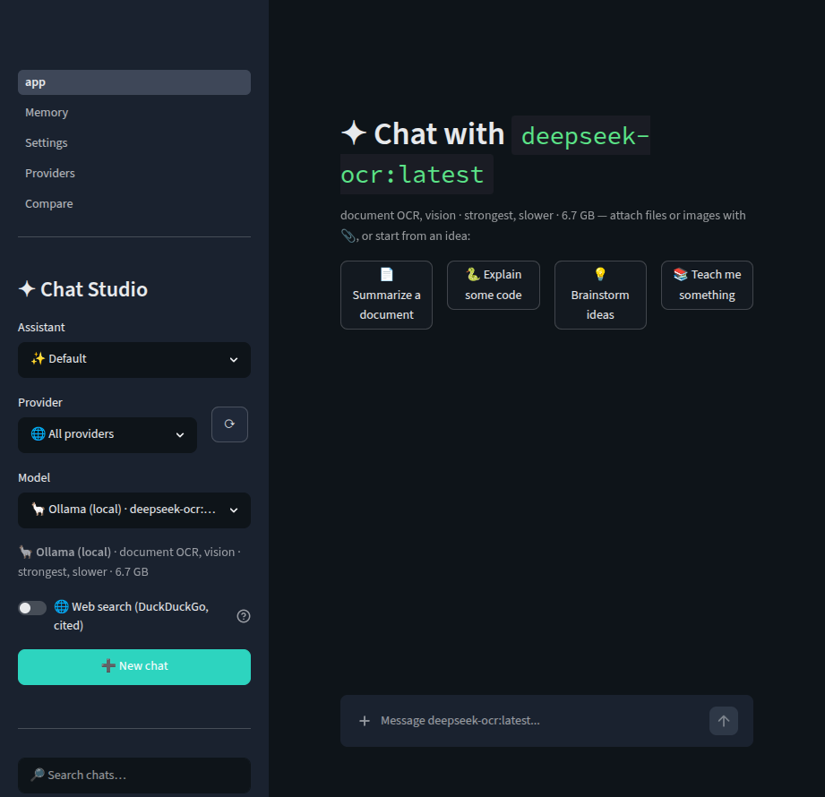
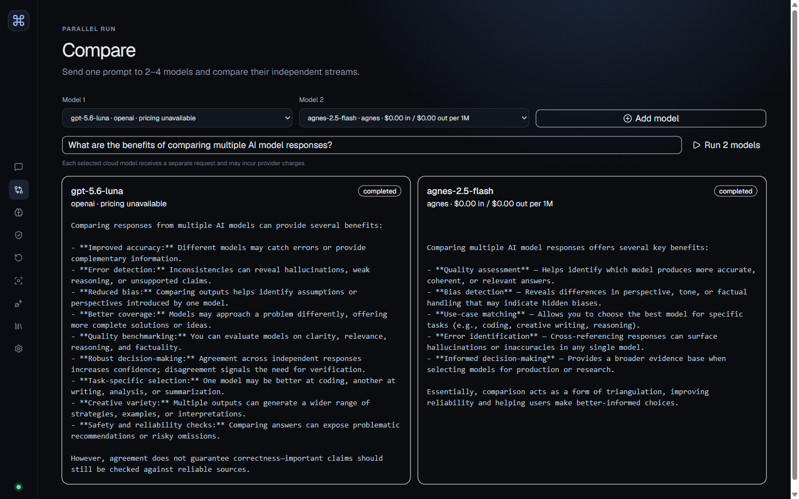

# Local AI Chat Studio

A local-first AI workspace for private conversations, controlled context, live model discovery, and replayable runs across Ollama and optional cloud providers.

[](https://github.com/pypi-ahmad/local-ai-chat-studio/actions/workflows/ci.yml)
[](https://github.com/pypi-ahmad/local-ai-chat-studio/releases/latest)
[](https://www.python.org/)
[](https://react.dev/)
[](LICENSE)

Local AI Chat Studio runs on your machine with a FastAPI backend and React frontend. It works with local Ollama models without an API key, while optional session-scoped credentials connect OpenAI, Agnes AI, Anthropic, Gemini, OpenRouter, xAI, OmniRoute, and OpenCode services.

## Features

### Conversations and generation

- **Streaming chat:** Responses arrive incrementally through server-sent events. A running generation can be cancelled without discarding the partial output already received.
- **Rich response rendering and artifact preview:** Chat and comparison answers render CommonMark and GitHub-flavored Markdown, tables, task lists, syntax-highlighted fenced code with copy controls, inline or display LaTeX through KaTeX, and fenced Mermaid diagrams. In Chat, **Preview** opens fenced HTML, SVG, Mermaid, or code output in a responsive split pane; executable formats use a scriptless iframe sandbox that blocks external resources, while code remains escaped source. Raw HTML outside fenced code remains disabled.
- **Conversation management:** Create, search, rename, pin, and delete conversations. Branch from any message to explore another direction while preserving the earlier history.
- **Message navigation:** Use a compact, responsive transcript rail to jump to the top, move through saved messages, or return to the bottom. The exact position counter and active-message marker preserve orientation, while a **New output** signal appears if a response streams while you are reading earlier content. The interaction is adapted from Chatbox's [message navigation pattern](https://github.com/chatboxai/chatbox/blob/main/src/renderer/components/chat/MessageNavigation.tsx).
- **Feedback and activity:** Rate assistant messages and inspect recorded runs, including status, model, timing, token usage, provenance, and integrity receipts.
- **Replay and comparison:** Replay a recorded run with another model and inspect its output diff, or export a full reproducibility bundle. Redacted bundles remove private context and image data for safer sharing.
- **Conversation exports:** Download the active transcript from the Chat header as Markdown, standalone HTML, plain text, or structured JSON. The same menu exports the active conversation's latest completed run as a full reproducibility bundle; generated HTML escapes message content and does not execute embedded markup.

### Parallel model comparison

- **Two to four models per prompt:** Select distinct local or cloud models and send the same prompt to all of them concurrently.
- **Independent live results:** Every model streams into its own result card with separate status, output, usage, and cost information.
- **Failure isolation:** One unavailable or failing provider does not stop successful comparisons. **Cancel all** stops every active comparison run together.
- **Ordinary, replayable runs:** Comparisons use the same persisted run pipeline as chat, so their results remain available for evidence, replay, diffs, and exports. Each cloud model is a separate billable request.

### Models, providers, and pricing

- **Local and cloud providers:** Use Ollama locally without an API key, or connect OpenAI, Agnes AI, Anthropic, Google Gemini, OpenRouter, xAI, OmniRoute, Ollama Cloud, OpenCode Zen, and OpenCode Go.
- **Live model discovery:** The Studio asks configured providers for their available models instead of relying only on a fixed list. Discovered entries can include context length, vision support, and provider metadata.
- **Searchable, capability-aware selection:** Choose a provider first, then search its discovered models by name, ID, or capability in Chat, Compare, Replay, and assistant presets. Provider marks, favorites, recent choices, verified pricing, context size, and vision, tool-use, and reasoning badges make large catalogs easier to scan; favorites and recents stay in local browser storage.
- **Composer control dock:** Chat keeps attachments, provider/model selection, capability-aware reasoning effort, context scope, and send/stop actions in one responsive dock. Choose **Full context**, **Chat only**, or **Files + chat** per turn; a compact menu holds temperature presets, opt-in web evidence, and optional local compression of older messages. Effort defaults to **Auto** and is disabled for models that do not advertise support; OpenAI GPT-5.6 options follow the [official model guide](https://developers.openai.com/api/docs/guides/latest-model).
- **Per-conversation settings:** Every chat independently remembers its model, reasoning effort, temperature, context policy, web/compression choices, system prompt, bound knowledge base, and **Conversation**, **Compact**, or **Full-width** message layout. Open **Settings** in the Chat header to edit the system prompt and layout; branches inherit the source settings once and can then diverge.
- **Focused navigation:** Desktop keeps Chat, Compare, and Library in **Primary**, Focus in **Workspace**, and provider/runtime controls in **Administration**. Mobile keeps the three primary destinations one tap away and moves advanced workspaces into **More**.
- **Run actions drawer:** Open **Runs** from Chat to replay recorded prompts, compare outputs, or export full and privacy-safe bundles without leaving the conversation.
- **Session-only credentials:** Keys entered in **Providers** remain in server-process memory for the browser session. Keys can alternatively come from operating-system environment variables; neither source is written to the database or exports.
- **Subscription OAuth:** ChatGPT, Claude, SuperGrok, and other supported subscription sign-ins are bridged through a loopback-only OpenCode server, which owns the upstream OAuth and streaming sessions.
- **Source-linked pricing:** Known models display standard input and output token rates with links to provider sources. The UI estimates preflight input cost and reports completed-run cost when usage is available; unknown or custom models stay explicitly unpriced.

### Controlled context and safety

- **Context preflight, compression, and pressure:** Before generation, review the exact context plan, used/available tokens, utilization percentage, automatic pruning, and a reserved 20% output budget. Enable **Compress older messages** to create a bounded local extractive summary while preserving the latest eight messages verbatim; the plan reports how many messages were compressed. Amber warnings appear from 80% utilization, and over-budget turns are blocked with the exact excess until context is reduced or a larger-context model is selected. A hash binds the approved plan to the run so changed context must be reviewed again.
- **Optional Chat inspector:** Open a docked desktop panel or responsive drawer to inspect the current context sections and evidence sources, including source trust and next-send inclusion, without leaving the conversation. The inspector remembers its open state and selected tab locally, closes with **Escape**, and dismisses when opening the full Context or Evidence page.
- **Source-level control:** Inspect and exclude individual conversation-history, memory, retrieval, upload, web, backpack, or focus sources before sending them to a model.
- **Provider data boundaries:** Cloud providers default to prompt-only access. Enable memory, retrieval, attachments, web results, or backpacks separately for each provider.
- **Safety findings:** Local scanning detects prompt-injection patterns, secrets, and personally identifiable information. Risky memory is quarantined, blocking findings require confirmation, and sensitive prompt text can be locally redacted before submission.
- **Provenance and integrity:** Context sources retain trust and origin metadata. Completed runs receive chained integrity receipts, while web evidence is cached with the approved plan and replayed without silently searching again.

### Knowledge, files, and focused work

- **Bound knowledge bases:** The Library has a dedicated, searchable Knowledge Bases workspace. Assemble reusable source sets from current-chat files, active memories, and backpacks; decide whether related-chat retrieval participates; inspect source availability; and bind exactly one base to a conversation. Bases and bindings stay in SQLite, while deleting a base safely unbinds its chats without deleting the original sources. The one-base-per-chat workflow is adapted from Chatbox's [Knowledge Base configuration](https://releases.chatboxai.app/en/guide/work-mode/configuration).
- **Local memory:** Add, pin, archive, approve, or delete durable memories. **Save memories & close** asks the selected model to extract and consolidate candidates from the conversation, records their message provenance, and requires confirmation before sending a full chat to a cloud model.
- **Cross-chat retrieval:** Reuse relevant details from previous conversations through optional Chroma embeddings. When no embedding model is configured, the Studio falls back to local lexical retrieval.
- **Context backpacks:** Save reusable project facts or instructions and make them available as an explicit context source.
- **Focus sessions:** Attach a temporary objective, success criteria, and constraints to a conversation to keep a task bounded.
- **Assistant gallery and personalization:** Search reusable assistants as visual cards with role icons and prompt descriptions, keep browser-local favorites and recent choices, and start a correctly configured conversation in one click. Each assistant carries its system prompt, preferred model, and temperature; the local personalization profile remains available separately.
- **Document and image inputs:** Parse PDF, Word, spreadsheet, text, and code files into selectable conversation context. Cards above the composer show upload and parsing/indexing progress, file type, exact size, ready state, and server errors. Failed uploads provide Retry and Remove actions; removing a ready card deletes the stored conversation upload. Supported vision models can receive selected image uploads directly.
- **Web evidence:** Opt-in search adds titled, linked results to the context plan with source provenance and replayable cached evidence.

### Local data and operations

- **Local-first persistence:** Conversations, messages, policies, memories, runs, and receipts live in SQLite under the configured data directory; uploads and optional Chroma collections remain local as well.
- **Portable data controls:** Export and import workspace data as JSONL; export individual conversations as Markdown, safe standalone HTML, plain text, or structured JSON; and explicitly migrate an earlier v2 database with a backup and repeat-import protection.
- **Privacy controls:** Redacted replay exports omit private context, **Panic wipe** removes local workspace data and session credentials, and provider keys are never included in exports.
- **Runtime visibility:** See FastAPI connectivity, Ollama availability, active Ollama models, and approximate VRAM use from **Settings**.
- **Managed shutdown:** **Stop Studio** cancels and drains active runs, closes SQLite cleanly, and stops the local Uvicorn server without stopping external Ollama or OpenCode processes.
- **One-file Windows and Linux launchers:** `Launch Chat Studio.cmd` and `Launch Chat Studio.sh` check prerequisites, install project-local tooling when needed, synchronize dependencies, rebuild changed frontend assets, start the server, and open the app. Later launches reuse the completed setup.

Cloud providers begin with prompt-only access. Credentials entered in the browser remain in server-process memory for that browser session and are not written to the database or included in exports.

## Workspace Navigation

Desktop navigation is grouped by purpose and can be collapsed. On mobile, **Chat**, **Compare**, and **Library** remain in the bottom bar; the other destinations are available through **More**.

Every destination has a direct browser URL, such as `/chat/<conversation-id>`,
`/compare`, `/library`, and `/settings`. Browser Back/Forward navigation and
bookmarked links preserve the selected workspace.

| Group | Tab | Purpose |
|---|---|---|
| Primary | **Chat** | Hold conversations; restore chat-specific model, effort, temperature, context, prompt, and layout settings; attach files; send or stop a run; and export the transcript or latest reproducibility bundle. |
| Primary | **Compare** | Send one prompt to two to four models concurrently and compare independent streamed results. |
| Primary | **Library** | Switch between the assistant gallery and Knowledge Bases; create reusable source sets from files, active memories, backpacks, and optional retrieval; bind one base per chat; and maintain the underlying local sources. |
| Workspace | **Focus** | Define a temporary objective, success criteria, and constraints for the active conversation. |
| Administration | **Providers** | Configure session credentials, provider data policies, OAuth connections, discovery, and failover checks. |
| Administration | **Settings** | Manage local data, personalization, runtime health, migration, wipe, and managed shutdown. |

Chat also includes an optional **Context/Evidence inspector**. On wide screens it docks beside the conversation; on smaller screens it opens as a drawer. Its open state and selected tab persist locally.
Transcript and latest-run exports are available from **Export** in the Chat header. Replay, diff, full-bundle, and redacted-bundle controls remain available from the **Runs** drawer. Legacy direct URLs for Context, Evidence, and Replay remain available for bookmarked workflows.

## Screenshots

| Chat with OpenAI Luna | Luna and Agnes parallel comparison |
|---|---|
|  |  |

## Tech Stack

| Area | Technologies |
|---|---|
| Backend | Python 3.12+, FastAPI, Uvicorn, Pydantic, HTTPX |
| Frontend | React 19, React Router 8, TypeScript 5.9, Vite 8, Tailwind CSS, Base UI |
| AI providers | Ollama, OpenAI SDK, Anthropic SDK, Google Gen AI, OpenAI-compatible APIs |
| Storage | SQLite, optional Chroma vector database, local uploads |
| Documents | pypdf, python-docx, pandas, openpyxl, xlrd, Pillow |
| Search | DDGS web search with replayed source provenance |
| Quality | pytest, Ruff, Vitest, Testing Library, Oxlint, GitHub Actions |

## Project Structure

```text
local-ai-chat-studio/
├── Launch Chat Studio.cmd   One-click Windows setup and launcher
├── Launch Chat Studio.sh    One-file Linux setup and launcher
├── backend/app/
│   ├── cli.py               Uvicorn entrypoint and managed shutdown
│   ├── main.py              FastAPI routes, sessions, and static frontend
│   ├── runs.py              Async runs, SSE, cancellation, and receipts
│   ├── workspace.py         Context planning, safety, retrieval, and web evidence
│   ├── providers.py         Provider adapters and live model discovery
│   ├── pricing.py           Source-linked model pricing metadata
│   ├── store.py             SQLite persistence, migration, and data controls
│   └── sessions.py          Session credential vault and environment fallbacks
├── frontend/
│   ├── src/App.tsx          Workspace composition and feature orchestration
│   ├── src/api/             Typed client and generated OpenAPI schema
│   ├── src/components/      Shared workspace and UI primitives
│   ├── src/features/        Models, assistants, attachments, knowledge bases, and safe artifact preview
│   ├── src/hooks/           Reusable responsive browser hooks
│   ├── src/state/           Local UI preference boundaries
│   └── package.json         Frontend commands and dependencies
├── src/                     Ollama, file parsing, retrieval, and shared helpers
├── scripts/                 OpenAPI-to-TypeScript generation
├── tests/                   Backend contracts and workspace behavior
├── docs/                    Architecture notes, screenshots, and tutorial
├── .env.example             Credential-free environment-variable template
├── pyproject.toml           Python package and `chat-studio` entrypoint
└── data/                    Local runtime state; created on first launch
```

## Installation and Setup

### Windows 11: one-click setup

Double-click **`Launch Chat Studio.cmd`**.

The launcher:

1. Gracefully stops a previous Studio, then terminates any remaining process listening on port `8506`.
2. Installs portable `uv`, Node.js LTS, and Python tooling inside `.runtime/` when missing.
3. Creates or updates `.venv` from the locked Python dependencies.
4. Installs frontend packages with `npm ci --legacy-peer-deps` only when its dependency fingerprint changed.
5. Rebuilds the frontend only when its source fingerprint changed.
6. Starts the managed server and opens <http://127.0.0.1:8506>.

Ollama is optional. The Studio can run entirely with a configured cloud provider.

Check setup without installing or launching anything:

```powershell
& '.\Launch Chat Studio.cmd' --check
```

The launcher owns port `8506`: normal launch terminates any process using that port before starting the Studio. Use `--check` first if another application may be using it.

### Linux: one-file setup

On a glibc-based x86_64 or ARM64 distribution such as Ubuntu, Debian, Fedora, or Arch, run:

```bash
./Launch\ Chat\ Studio.sh
```

The script installs portable `uv`, managed Python, and Node.js LTS inside `.runtime/`, synchronizes only stale dependencies, builds changed frontend assets, clears port `8506`, starts the Studio, and opens the browser. It does not use `sudo` or modify system packages. Bash, `tar` with xz support, and either `curl` or `wget` must already be available; `fuser`, `lsof`, or `ss` is required to identify a non-Studio port owner.

The executable bit is stored in Git. If it was lost while copying or extracting the project, use:

```bash
bash 'Launch Chat Studio.sh'
```

Check setup without downloading, installing, building, or launching:

```bash
bash 'Launch Chat Studio.sh' --check
```

The launcher supports mainstream glibc Linux. Alpine and other musl-based distributions are not supported by its portable Node.js setup.

### Manual setup

Requirements:

- Python 3.12+
- [uv](https://docs.astral.sh/uv/)
- Node.js 22 recommended; CI uses `22.12`
- [Ollama](https://ollama.com/) only for local models

```powershell
git clone https://github.com/pypi-ahmad/local-ai-chat-studio.git
cd local-ai-chat-studio

uv sync --locked --dev

cd frontend
npm ci --legacy-peer-deps
npm run build
cd ..

uv run chat-studio
```

Open <http://127.0.0.1:8506>. Stop the server with **Settings → Stop Studio** or `Ctrl+C` in the launcher console.

### Development mode

Start the backend:

```powershell
uv run chat-studio
```

In another terminal, start Vite:

```powershell
cd frontend
npm run dev
```

Vite binds to localhost and proxies `/api` to `http://127.0.0.1:8506`.

## Environment Variables

Provider credentials must be set in the operating-system environment before launch or entered temporarily in the **Providers** page. The application never writes credential values to `.env`.

Use [`.env.example`](.env.example) as a credential-free name template. Do not commit real keys.

### Windows user-scoped credentials

To make credentials available to future terminals and double-click launcher sessions on your own Windows account, store them as user environment variables. Replace the placeholders locally; never paste real values into tracked files:

```powershell
[Environment]::SetEnvironmentVariable('OPENAI_API_KEY', '<your-key>', 'User')
[Environment]::SetEnvironmentVariable('OPENAI_BASE_URL', 'https://api.openai.com/v1', 'User')
[Environment]::SetEnvironmentVariable('AGNES_API_KEY', '<your-key>', 'User')
```

Open a new terminal or restart the launcher after changing user variables. Other users should set their own values; [`.env.example`](.env.example) intentionally contains blank credential placeholders.

### Runtime and endpoints

| Variable | Default | Purpose |
|---|---|---|
| `CHAT_DATA_DIR` | `data` | SQLite, upload, migration, and vector-data root |
| `CHAT_OLLAMA_HOST` | `http://localhost:11434` | Local or remote Ollama endpoint |
| `CHAT_EMBED_MODEL` | unset | Installed Ollama embedding model used for Chroma retrieval |
| `OPENAI_BASE_URL` | OpenAI SDK default | OpenAI or compatible `/v1` endpoint |
| `OMNIROUTE_BASE_URL` | `http://localhost:8082/v1` | OmniRoute-compatible endpoint |
| `OPENCODE_SERVER_URL` | `http://127.0.0.1:4096` | Loopback OpenCode server; non-loopback URLs are rejected |
| `OPENCODE_SERVER_USERNAME` | `opencode` | Optional OpenCode basic-auth username |
| `OPENCODE_SERVER_PASSWORD` | unset | Optional OpenCode basic-auth password |

### Provider credentials

| Provider | Environment variable |
|---|---|
| Ollama Cloud | `OLLAMA_API_KEY` |
| OpenAI | `OPENAI_API_KEY` |
| Agnes AI | `AGNES_API_KEY` |
| Anthropic | `ANTHROPIC_API_KEY` |
| Google Gemini | `GEMINI_API_KEY` |
| OpenRouter | `OPENROUTER_API_KEY` |
| xAI | `XAI_API_KEY` |
| OmniRoute | `OMNIROUTE_API_KEY` |
| OpenCode Zen | `OPENCODE_ZEN_API_KEY` |
| OpenCode Go | `OPENCODE_GO_API_KEY` |

### Anthropic workload identity

Anthropic can also report workload identity as its credential source. Configure either `ANTHROPIC_PROFILE`, or all required identity fields below:

- `ANTHROPIC_FEDERATION_RULE_ID`
- `ANTHROPIC_ORGANIZATION_ID`
- `ANTHROPIC_SERVICE_ACCOUNT_ID`
- `ANTHROPIC_IDENTITY_TOKEN` or `ANTHROPIC_IDENTITY_TOKEN_FILE`

### Advanced shared settings

`src/config.py` exposes additional `CHAT_`-prefixed settings used by shared Ollama, memory, and retrieval helpers:

| Variables | Purpose |
|---|---|
| `CHAT_TEMPERATURE`, `CHAT_KEEP_ALIVE`, `CHAT_REQUEST_TIMEOUT` | Generation and Ollama runtime defaults |
| `CHAT_SHOW_CLOUD_MODELS`, `CHAT_MEMORY_ENABLED`, `CHAT_CROSS_CHAT_REFERENCES` | Feature toggles |
| `CHAT_CHUNK_CHARS`, `CHAT_CHUNK_OVERLAP_CHARS`, `CHAT_DOC_CONTEXT_BUDGET_CHARS` | Document chunking and direct-context limits |
| `CHAT_RAG_TOP_K`, `CHAT_CROSS_CHAT_TOP_K`, `CHAT_CROSS_CHAT_MIN_SIMILARITY` | Retrieval limits and similarity threshold |
| `CHAT_MEMORY_MAX_INJECTED`, `CHAT_MEMORY_DECAY_DAYS`, `CHAT_PROFILE_REFRESH_EVERY` | Memory and profile maintenance defaults |

## Configuration Options

### Providers and data boundaries

The **Providers** page supports temporary API keys, supported OAuth flows, live model discovery, provider health, and failure simulation. Remote providers start with prompt-only context; history, memory, files, web results, and personalization remain explicit per-provider policy toggles.

### Context and safety

Before a message is sent, the Studio builds a context plan that shows estimated tokens, source provenance, trust state, automatic pruning, and a 20% output reserve. The shared context rail displays used/available tokens and the exact safe-budget percentage in Chat, Context, and the inspector. At 80% it warns about remaining capacity; above 100% it reports the precise overflow and prevents the turn from reaching a provider. Optional **Compress older messages** summarizes earlier turns locally and deterministically, keeps the latest eight messages verbatim, and reports the compressed count. Users can exclude trusted sources, redact sensitive text, and must confirm blocking safety findings.

### Pricing

The searchable model picker displays context length, vision, tool-use, and reasoning support, plus standard text-token rates when providers report them. Use the **Vision**, **Tools**, and **Reasoning** filters to narrow the current provider's catalog, star frequently used models, or return to recent choices. The Studio estimates preflight input cost when verified pricing exists. Estimates exclude cached-token discounts, batch or priority pricing, tools, media, taxes, subscriptions, and other provider-specific adjustments. Unknown models and custom OpenAI-compatible gateways remain visibly unpriced rather than using invented values.

### Persistence and retrieval

Canonical state lives in `data/app.db`, including each conversation's validated settings snapshot, knowledge-base definitions, ordered source references, and per-chat binding; uploads and optional Chroma collections remain under the configured data directory. Deleting a referenced upload, memory, or backpack removes that reference from its bases, and deleting a base clears affected conversation bindings. Existing databases receive compatible schema additions automatically. Without `CHAT_EMBED_MODEL`, cross-chat retrieval uses local lexical search. An earlier `data/v2/studio.db` can be imported explicitly from **Settings**; the Studio backs up `app.db` and records the migration so repeat imports are no-ops.

## Usage

1. Start the Studio and open <http://127.0.0.1:8506>.
2. Select an installed Ollama model or connect a provider. Choose the provider, open the model field, then search, filter by capability, star a favorite, or choose a recent model.
3. Create a conversation and optionally open its header **Settings** to set a system prompt and message layout. Model, effort, temperature, context, web, and compression choices are saved automatically for that chat. Attach documents or images as needed; follow each card through **Uploading** and **Parsing & indexing** to **Ready**.
4. Enter a message and review its context plan, safety findings, sources, and estimated cost.
5. Confirm required findings and send the turn.
6. Watch streamed events, cancel if needed, and use the transcript navigator to jump to either end or move between saved messages. If **New output** appears while you are reading earlier content, use the bottom action to return to the live answer. Inspect completed runs under **Evidence** or **Replay**.
7. Open **Compare**, choose two to four distinct models, and run one prompt across them in parallel. Each response streams independently, one provider failure does not stop the others, and **Cancel all** stops every active comparison run. Every selected cloud model receives a separate billable request.
8. Use **Preview** on a fenced HTML, SVG, Mermaid, or code block to inspect it beside the transcript, then close the pane when finished. Executable previews are isolated and cannot load external resources.
9. Branch the conversation, provide feedback, or open **Export** to download Markdown, HTML, TXT, JSON, or the latest completed run's reproducibility bundle.

### Example: launch with OpenAI

Set credentials for the current PowerShell process without writing them to disk:

```powershell
$env:OPENAI_API_KEY = '<your-key>'
$env:OPENAI_BASE_URL = 'https://api.openai.com/v1'
uv run chat-studio
```

The Studio discovers available OpenAI models at runtime. `gpt-5.6-luna` uses its required provider-default temperature; the adapter omits the unsupported custom temperature parameter for that model. Remove the variables from the process when finished:

```powershell
Remove-Item Env:OPENAI_API_KEY
Remove-Item Env:OPENAI_BASE_URL
```

### Example: launch with Agnes AI

```powershell
$env:AGNES_API_KEY = '<your-key>'
uv run chat-studio
```

Agnes AI uses its official OpenAI-compatible endpoint and exposes `agnes-2.5-flash`. See the [Agnes AI overview](https://www.agnes-ai.com/en/docs/overview) and [Agnes 2.5 Flash documentation](https://www.agnes-ai.com/en/docs/agnes-25-flash).

## How It Works

```text
React UI
   │
   ├─ chat: preflight one turn
   └─ compare: fan one prompt out to 2–4 independent runs
   ▼
FastAPI API ── session boundary ── in-memory credential vault
   │
   ├─ safety scan and context planning
   ├─ history, memory, files, web evidence, and retrieval
   └─ confirmation and source exclusions
   │
   ▼
RunManager ── normalized provider adapter ── Ollama or cloud model
   │
   ├─ server-sent events (SSE)
   ├─ cancellation and partial output
   └─ metrics, provenance, and integrity receipt
   │
   ▼
SQLite canonical store + optional Chroma retrieval
```

The frontend uses OpenAPI-derived TypeScript contracts. A preflight plan is hashed; if context changes before execution, the API returns a conflict and requires review again. `RunManager` owns asynchronous provider execution and event retention, while SQLite stores durable workspace state.

Comparison uses the same ordinary run and SSE endpoints as chat. The browser creates all selected runs concurrently, maps each stream to its own result card, preserves successful responses when another provider fails, and cancels every created run through the existing session-owned cancellation endpoint.

## Models and References

The Studio discovers models live from each configured provider. Provider catalogs are the authoritative place to review all currently available models, capabilities, identifiers, and prices.

| Provider | Models and documentation | Pricing reference |
|---|---|---|
| Ollama | [Model library](https://ollama.com/search) | Local inference is shown as `$0`; hosted terms are provider-defined |
| OpenAI | [Models](https://developers.openai.com/api/docs/models) | [Models and pricing](https://developers.openai.com/api/docs/models) |
| Agnes AI | [Overview](https://www.agnes-ai.com/en/docs/overview) · [`agnes-2.5-flash`](https://www.agnes-ai.com/en/docs/agnes-25-flash) | [`agnes-2.5-flash` limits and pricing](https://www.agnes-ai.com/en/docs/agnes-25-flash#limits-and-pricing) |
| Anthropic | [Claude models overview](https://docs.anthropic.com/en/docs/about-claude/models/overview) | [Claude pricing](https://docs.anthropic.com/en/docs/about-claude/pricing) |
| Google Gemini | [Gemini models](https://ai.google.dev/gemini-api/docs/models) | [Gemini API pricing](https://ai.google.dev/gemini-api/docs/pricing) |
| OpenRouter | [Model catalog](https://openrouter.ai/models) · [Models API](https://openrouter.ai/docs/api/api-reference/models/get-models) | Live pricing metadata from the Models API |
| xAI | [Models](https://docs.x.ai/developers/models) | [Pricing](https://docs.x.ai/developers/pricing) |
| OpenCode | [Zen documentation](https://opencode.ai/docs/zen/) | [Zen pricing](https://opencode.ai/docs/zen/#pricing) |

Additional project references:

- Interactive FastAPI reference: <http://127.0.0.1:8506/docs>
- [User guide](USER_GUIDE.md)
- [Technical guide](TECHNICAL.md)
- [Code tutorial](CODE_TUTORIAL.md)
- [Offline Zero-to-Hero tutorial](docs/tutorial/index.html)
- [Integration reference](docs/codebase/INTEGRATIONS.md)
- [Chatbox releases](https://github.com/chatboxai/chatbox/releases) — interaction-pattern reference for context pressure and compression
- [Changelog](CHANGELOG.md)

## Verification

Run the same checks used by CI:

```powershell
uv run python -m pytest -q
uv run ruff check backend tests

cd frontend
npm run lint
npm test
npm run build
```

Regenerate the frontend API schema after changing FastAPI contracts:

```powershell
cd frontend
npm run generate:api
```

## Security

The server binds to `127.0.0.1` and has no user-account or multi-tenant authentication layer. Do not expose it directly to an untrusted network. Provider credentials are session-scoped in memory or read from the launching process environment; they are not persisted or exported.

See [SECURITY.md](SECURITY.md) for the security model and private vulnerability-reporting instructions.

## License

Released under the [MIT License](LICENSE). Copyright © 2026 Ahmad Mujtaba.

<p align="center">Made with ❤️ by Ahmad Mujtaba</p>
