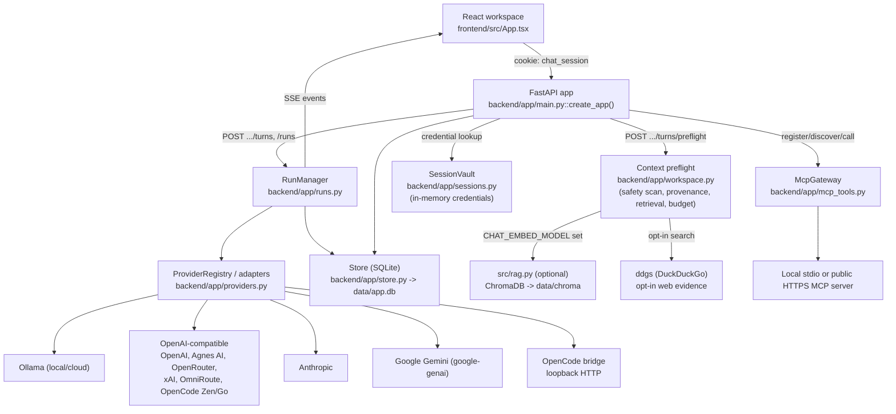

# Architecture

`create_app()` composes one legacy-compatible `Store`, session credential vault,
provider registry, and run manager. Preflight produces a hash-bound context plan. A
turn is accepted only when the plan still matches and required safety findings were
confirmed. Exact web evidence is cached by plan hash; individual sources can be
excluded. The frontend derives utilization and remaining or excess tokens from the
plan's estimated and safe-budget totals. It blocks submission while a plan remains
over budget. When requested, the backend locally compresses older history into a
deterministic summary, retains the latest eight messages verbatim, and includes the
summary source and compressed count in the hash-bound plan.

Conversation generation settings are stored as a validated JSON snapshot beside the
conversation row. Chat hydrates that snapshot when the active conversation changes
and debounces updates through the existing PATCH endpoint. System prompts flow into
preflight estimation, the plan hash, assembled messages, and replay data. Branches
copy settings at creation and remain independent afterward.
Library assistants pass the same snapshot during conversation creation, so the
preset's model, temperature, and system prompt are committed atomically. Favorite
and recent assistant IDs stay in browser storage and do not alter preset records.
Library knowledge bases also use that snapshot: `knowledge_base_id` binds at most one
base to a conversation. The base stores ordered references to files, active memories,
and backpacks, plus a switch for related-chat retrieval. Preflight expands those
references at send time, scans the complete source text, applies provider source
policies, and exposes each approved item under a separate `knowledge` section. Source
records remain authoritative; deleting a base only unbinds conversations.

Runs are persisted to SQLite and also retained in memory while the process lives so
SSE subscribers can replay events and follow new deltas. Run IDs are scoped to the
owning browser session. Completed runs append assistant messages and chained receipt
hashes.

Transcript exports read the persisted conversation and serialize it as Markdown,
plain text, structured JSON, or escaped standalone HTML. Reproducibility export is a
separate run artifact: Chat selects the newest completed run for the active
conversation, then uses the existing session-owned bundle endpoint. This keeps run
request/context data out of ordinary transcript formats and prevents cross-chat bundle
selection.

The Compare workspace fans one prompt out to two to four ordinary runs concurrently.
Each result retains its own status, output, and safe error; one failed provider does not
stop the others. **Cancel all** aborts each browser stream and cancels every created run
through the existing session-owned run endpoint.

Rich message fences can emit a typed client-side artifact. Chat stores only the current
selection in temporary React state and lays its transcript beside a preview pane.
HTML, SVG, and Mermaid output cross a unique-origin, scriptless iframe boundary with a
restrictive CSP; code is displayed as escaped source. Artifact preview does not alter
messages, runs, exports, or the backend contract.

FastAPI serves `frontend/dist` at `/`. Shared helpers under `src/` provide file parsing,
Ollama health/embeddings, and the existing `data/chroma` collections.

Memory extraction is separate from normal turn assembly. On an explicit **Save memories
& close** action, the selected model first extracts candidates from the full chat and
then consolidates them against existing memories. SQLite commits the accepted batch and
the conversation extraction timestamp together; active memories are mirrored to Chroma
only when an embedding model is configured. Provenance stays with the SQLite record.

Conversation organization is durable: `conversations.folder` is added compatibly at
startup, returned by the generated API contract, and included in list search. The React
shell groups pinned, foldered, and date-bucketed chats while keeping sidebar width,
navigation collapse, inspector state, and command-palette visibility as transient or
browser-local UI state.

The frontend keeps `App.tsx` as the session and API orchestration boundary. Typed page
components live under `routes/`; Chat composes the smaller `ChatComposer`,
`MessageList`, provider-scoped model picker, and Context/Evidence inspector features.
Browser-persisted shell preferences are isolated in `useWorkspacePreferences`, while
conversation-owned model, prompt, context, and layout settings continue to hydrate
from and save through the generated backend contract. `RouteErrorBoundary` wraps the
selected page so one route-level render failure does not replace the whole browser
shell.

Provider adapters separate Ollama Local from Ollama Cloud. OpenCode is a loopback-only
server bridge: it owns upstream OAuth and streaming sessions, while this app continues
to apply remote-provider context policy before sending chat context to it.

After model discovery, `ProviderRegistry` attaches optional `ModelPricing` metadata.
The pricing catalog is source-linked and dated; OpenRouter pricing is read from its
live model payload. Preflight token estimates are multiplied by the selected model's
standard input rate in the browser. Pricing is presentation metadata and does not
alter routing, billing, or provider requests.

The system is deliberately single-process and localhost-first. Horizontal scaling
would require external run events and credential/session state.

MCP tools form a separate guarded execution path. Server definitions and discovered
JSON Schemas are global local-workspace records; tool requests are scoped by a hash of
the HTTP session cookie. Registration is inert. Discovery explicitly connects, and
invocation first writes a pending immutable argument hash. An atomic approve/deny
transition prevents replay. Successful approval reconnects to the stored server,
executes exactly the stored tool and arguments, bounds/redacts the result, optionally
adds it as a `tool` message to its conversation, and scrubs raw arguments. Local stdio
uses an argv launch, minimal environment, timeout, and isolated working directory;
remote transport is limited to public HTTPS. The boundary is not an OS sandbox.

Managed shutdown is part of that single-process model. Settings **Stop Studio**
posts to `/api/v1/runtime/shutdown`, `RunManager.shutdown()` cancels and awaits
active generation tasks, then the CLI sets `uvicorn.Server.should_exit`. Process
lifespan performs the same run drain and closes SQLite. Ollama and OpenCode are
not stopped.

## Main types and where they live

| Type/state | Location | Lifetime |
| --- | --- | --- |
| `Store` | `backend/app/store.py` | One instance per `create_app()` call; owns the `sqlite3` connection and all SQL. |
| `RunManager` / `RunState` | `backend/app/runs.py` | Process memory only. `RunState` (snapshot, SSE event log, cancel flag, asyncio task) is dropped once a run completes and no client still holds a reference; `RunSnapshot`/events are also persisted to `runs`/`run_events` tables. |
| `SessionVault` | `backend/app/sessions.py` | Process memory only, keyed by the `chat_session` cookie value; cleared by `/api/v1/data/wipe` or a process restart. Never touches SQLite. |
| `ProviderRegistry` / `ProviderAdapter` subclasses | `backend/app/providers.py` | Built once in `create_app()` from `build_provider_registry()`; adapters are stateless except for a `_models` cache used by `supports_images()`. |
| Pydantic contracts (`ContextPlan`, `TurnPreflight`, `RunSnapshot`, `Conversation`, `McpServer`, etc.) | `backend/app/contracts.py` | Request/response shapes; also the source FastAPI uses to generate `openapi.json`, which `frontend/src/api/schema.ts` is generated from. |
| `McpGateway` (`DefaultMcpGateway`) | `backend/app/mcp_tools.py` | Stateless; opens a new stdio/Streamable HTTP session per discover/call. |
| Chroma collections (`doc_chunks`, `chat_history`, `memories`) | `src/rag.py` | Persisted under `data/chroma` via `chromadb.PersistentClient`; only touched when `CHAT_EMBED_MODEL` is set. |
| React session/route state | `frontend/src/App.tsx`, `frontend/src/app/`, `frontend/src/routes/` | Backend-derived state (conversations, runs, settings) is fetched through generated `frontend/src/api/` types; only shell preferences (navigation collapse, inspector state, sidebar width) live in browser storage. |

## External systems

Verified against actual imports in `backend/app/providers.py`, `backend/app/workspace.py`,
`src/rag.py`, and `pyproject.toml`:

| System | Where it's called | Client library | Optional? |
| --- | --- | --- | --- |
| Ollama (local and `:cloud`) | `OllamaAdapter` in `backend/app/providers.py`; `src/ollama_client.py` for health/embeddings | `ollama` (`AsyncClient`) | Local Ollama is optional if a cloud provider is configured |
| OpenAI | `OpenAICompatibleAdapter` | `openai` (`AsyncOpenAI`) | Yes — BYOK |
| Agnes AI, OpenRouter, xAI, OmniRoute, OpenCode Zen, OpenCode Go | `OpenAICompatibleAdapter` / `OpenCodeZenAdapter` (OpenAI-compatible endpoints) | `openai` (`AsyncOpenAI`), plus raw `httpx` for OpenCode Zen's Gemini-shaped and Anthropic-shaped model families | Yes — BYOK |
| Anthropic | `AnthropicAdapter`; also reachable inside `OpenCodeZenAdapter` for `claude-`/`qwen` models | `anthropic` (`AsyncAnthropic`) | Yes — BYOK or workload identity federation |
| Google Gemini | `GeminiAdapter` | `google-genai` (`google.genai`) | Yes — BYOK |
| OpenCode bridge | `OpenCodeBridgeAdapter` | `httpx` (loopback HTTP only; `OPENCODE_SERVER_URL` must resolve to `127.0.0.1`/`localhost`/`::1`) | Yes — only if an OpenCode server is running |
| ChromaDB | `src/rag.py` | `chromadb` (`PersistentClient` under `data/chroma`) | Yes — only when `CHAT_EMBED_MODEL` is set; otherwise retrieval falls back to SQLite `LIKE` search |
| DuckDuckGo (web search) | `search_web()` in `backend/app/workspace.py` | `ddgs` (`DDGS().text()`) | Yes — opt-in per turn |
| Model Context Protocol servers | `backend/app/mcp_tools.py` | `mcp` SDK + `httpx2` (Streamable HTTP) | Yes — user-registered, per server |
